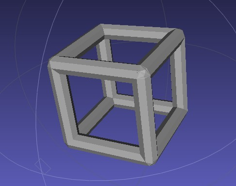

Frameworx.js
============

Introduction
------------

This module is designed to make it easier to write programs using node.js to generate 3D frameworks. It was built to solve a particular problem - that of generating 3D fractal truss structures to be 3D printed. However I think it might be of use to others so I am releasing it here under the GPL license.

What this module does
---------------------

This module allows for the generation of 3D frameworks by placing "sticks" and by copying and manipulating sticks. It provides functions to generate new sticks by specifying start and end points, but also to translate, scale and rotate sticks or groups of sticks. Finally, the resulting framework can be written out to a binary .STL file.

What this module does not do
----------------------------

* This module cannot create any shape other than sticks.
* This module doesn't properly calculate the juntion of more than one stick - it simply renders the two sticks one on top of the other. In most cases this doesn't matter as it is resovled by 3D printing / rendering software.
* This module doesn't display any 3D - it just creates .STL files. You will need a program such as [MeshLab](http://meshlab.sourceforge.net/) to visualize the output from the resulting .STL file.

Examples
--------

### examples/cube.js ###

The following code will generate a simple cube frame as shown in the image below

	var frameworx = require('..');

	var cube = new frameworx.framework();

	var stick = new frameworx.stick([0,0,0],[0,0,10]).translate([-5,-5,-5]);

	// Use the basic stick and 2 rotated copies to make a U shape
	cube.add(stick);
	cube.add(stick.rotateX(90));
	cube.add(stick.rotateX(-90));

	// Add a rotated copy of the U shape
	cube.add(cube.rotateZ(90));
	// Add a rotated copy of everything we have so far - this gives us a ring of 4 U shapes - i.e. a cube
	cube.add(cube.rotateZ(180));

	// Create a new .STL to write the framework out to
	var stlFile = new frameworx.stlFile('output/cube.stl');
	
	// Actually write the framework to the .STL file
	// All sticks will be 1mm in diameter and have 8 sides
	cube.renderStl(stlFile,1,8);
	
	// Close off the .STL file
	stlFile.close();

	// Now run command something like this...
	// node cube.js && meshlab output/cube.stl

Objects
=======

stlFile(filename)
-----------------

This creates an .STL file for writing a framework out to. The file is created as soon as this stlFile object is instantiated. Things to note:

* Any existing file with the same name will be removed.
* More than one framework can be written to a single stlFile.
* You must close the stl file by calling the .close() method when you are finished with it.

#### example ####

	var frameworx = require('frameworx');

	... code to generate some frameworks ...
	
	var stlFile = new frameworx.stlFile('output.stl');
	framework1.renderStl(stlFile);
	framework2.renderStl(stlFile);
	
	stlFile.close();

stick(start, end)	
-----------------

This creates a single new stick. The start and end are specified as three element arrays defining X,Y and Z coordinate in Cartesian space.

Sticks can't be sent to an STL file on their own - they must be added to a framework. 
Stick have translate, rotate and scale methods which are identical to frameworks as detailed below.
eba

#### example ####

	var frameworx = require('frameworx');

	var theFrame = new frameworx.framework();

	// ================ CREATE THE STICK ================ //
	var theStick = new frameworx.stick([0,0,0],[10,10,10]);
	// ================================================== //
	
	theFrame.add(theStick);

	var stlFile = new frameworx.stlFile('output.stl');
	
	theFrame.renderStl(stlFile,1,8);
	
	// Close off the .STL file
	stlFile.close();

### stick.length() ###

Returns the length of the stick.

#### example ####

	var frameworx = require('frameworx');

	var theStick = new frameworx.stick([0,0,0],[10,10,10]);

	// The following outputs 17.320508075688775 i.e. the square root of 300
	console.log( theStick.length() );
	
### stick.translate() ###

Same as framework.translate() - see below.
 
### stick.rotateX() ###

Same as framework.rotateX() - see below.

### stick.rotateY() ###

Same as framework.rotateY() - see below.

### stick.rotateZ() ###

Same as framework.rotateZ() - see below.

### stick.scale() ###

Same as framework.scale() - see below.

framework()
-----------

A framework is a collection of sticks which can be manipulated as a single entity.

### framework.translate( offset ) ###
### framework.translate( offsetX, offsetY, offsetZ ) ###

This moves all the emelements by the offset specified. Offset can be specified either as three separate arguments or as a single three-element array specifying x, y and z offsets. The original framework remains unchanged. The new translated framework is returned.

#### example ####

	var frameworx = require('frameworx');

	var theFrame = new frameworx.framework();

	var theStick = new frameworx.stick([0,0,0],[10,10,10]);

	// ================== TRANSLATE THE STICK ================== //
	theStick = theStick.translate( 10,10,10 );
	// theStick will now starts at [10,10,10] and ends at [20,20,20]
	
	theFrame.add(theStick);

	// ================== TRANSLATE THE FRAME ================== //
	// This time we pass the offset as array
	theFrame = theFrame.translate( [10,10,10] );
	// theFrame now contains one stick stretching from [30,30,30] to [40,40,40]
	
	var stlFile = new frameworx.stlFile('output.stl');
	
	theFrame.renderStl(stlFile,1,8);
	
	// Close off the .STL file
	stlFile.close();

 
### framework.rotateX( degrees ) ###

Rotate the framework around the X axis by the specified number of degrees. The original framework remains unchanged. The new translated framework is returned.

#### example ####

	var frameworx = require('frameworx');

	var theFrame = new frameworx.framework();

	var theStick = new frameworx.stick([0,0,0],[0,10,0]);

	// ================== ROTATE THE STICK ================== //
	// Before rotation theStick points along the Y axis
	theStick = theStick.rotateX( 90 );
	// theStick will now lie on the Z axis
		
	theFrame.add(theStick);

	// ================== ROTATE THE FRAME ================== //
	// Rotate the framework - this is a bit pointless since it just rotates the stick back where it was
	theFrame = theFrame.rotateX( -90 );
	// theFrame now contains one stick stretching from [0,0,0] to [0,10,0]
	
	var stlFile = new frameworx.stlFile('output.stl');
	
	theFrame.renderStl(stlFile,1,8);
	
	// Close off the .STL file
	stlFile.close();

### framework.rotateY() ###

Same as framework.rotateX but just rotates around the Y axis

### framework.rotateZ() ###

Same as framework.rotateX but just rotates around the Z axis

### framework.scale( factor ) ###
### framework.scale( xFactor, yFactor, zFactor ) ###
### framework.scale( [xFactor, yFactor, zFactor] ) ###

Scale's the framework out from the origin (0,0,0) i.e multiplies the x,y and z coordinates by the resepctive factor. If just a single number is passed then x, y and z coordinates are all scaled by the same amount. The original framework remains unchanged. The new translated framework is returned.

**Don't forget that to keep the shape the same in any given dimension you should use a scale factor of 1 not 0.** If any of the scale factors are zero this will flatten the shape onto one of the axis. If 2 are zero you will just flatten everything down to a line and if all three are zero you will just end up with a dot at the origin.

#### example ####

	var frameworx = require('frameworx');

	var theFrame = new frameworx.framework();

	var theStick = new frameworx.stick([0,0,0],[1,1,1]);

	// ================== SCALE THE STICK ================== //
	theStick = theStick.scale( 10 );
	// theStick will now lie from [0,0,0] to [10,10,10]
		
	theFrame.add(theStick);

	// ================== SCALE THE FRAME ================== //
	// This time we will scale different axis by different amounts
	theFrame = theFrame.scale( [ 1, 2, 3 ] );
	// theFrame now contains one stick stretching from [0,0,0] to [10,20,30]
	
	var stlFile = new frameworx.stlFile('output.stl');
	
	theFrame.renderStl(stlFile,1,8);
	
	// Close off the .STL file
	stlFile.close();

### framework.scaleX( factor ) ###
### framework.scaleY( factor ) ###
### framework.scaleZ( factor ) ###

Similar to framework.scale() above except that the framework is scaled in only one direction - basically this just sets the scale factor for the other 2 axis to 1.

### framework.split( [numSegments=2] ) ###

This splits every stick in the framework into a number of equal length sticks. If numSegments is ommitted then all sticks are split in half (segments=2).

This method can be useful prior to calling framework.mergePoints() to allow sticks to "bend" when points are merged.

**Unlike other method calls, in this case, the original framework IS changed.** This method call returns the object itself (not a new copy of it).

#### example ####

	var frameworx = require('frameworx');

	var theFrame = new frameworx.framework();

	var theStick = new frameworx.stick([0,0,0],[30,30,30]);		

	theFrame.add(theStick);

	// ================== SPLIT THE FRAME ================== //
	theFrame.split( 3 );
	// theFrame now contains 3 stick: one from [0,0,0] to [10,10,10], one from [10,10,10] to [20,20,20] and one from from [20,20,20] to [30,30,30],  
	
	var stlFile = new frameworx.stlFile('output.stl');
	
	theFrame.renderStl(stlFile,1,8);
	
	// Close off the .STL file
	stlFile.close();

### framework.mergePoints( proximity ) ###

This analyzes the framework and moves stick ends which are close, but not on top of each other, so that they end up on top of each other. This can be used to tidy up a framework which has been generated programatically but looks messy because there are lines which almost meet but don't quite.

The proximity parameter defines how close points have to be before they are merged. When merging takes place, all points which are close to each other are moved to the average location of all the nearby points.

**Unlike other method calls, in this case, the original framework IS changed.** This method call returns the object itself (not a new copy of it).

#### example ####

	var frameworx = require('frameworx');

	var theFrame = new frameworx.framework();

	var theStick = new frameworx.stick([0,0,0],[10,10,10]);		

	theFrame.add(theStick);
	// add a translated copy of the stick such that the ends don't quite match
	theFrame.add(theStick.translate(12,12,12));

	// ================== MERGE NEARBY POINTS ================== //
	// Don't forget that distance is on the diagonal
	// so in this case we need to set the proximity to at least the square root of 6
	theFrame.mergePoints( 3 );
	// theFrame now contains 2 sticks: one from [0,0,0] to [11,11,11] and one from [11,11,11] to [22,22,22]

	var stlFile = new frameworx.stlFile('output.stl');
	
	theFrame.renderStl(stlFile,1,8);
	
	// Close off the .STL file
	stlFile.close();

### framework.mergeSticks( proximity, [tolerance=0.1], [repeat=2] ) ###

#### example ####
